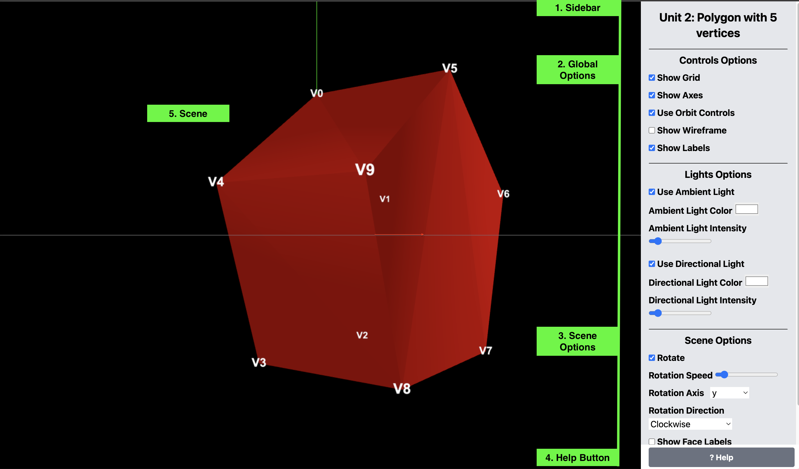

# AY2025 - T2 - CS4406 - Computer Graphics

This repository contains assignments for the course CS4406 - Computer Graphics, year 2025, term 2, at the
University of the People (UoPeople) done by the student Ahmad Ali.

Live URL: <https://ahmad-ali14.github.io/AY2025-T2-CS4406/>

## Notes

-   The repository is organized into directories, one for each unit.
-   The repository will be deleted after the course ends.
-   We will be using the latest version of Three.js for the assignments `v0.170`.
-   The assignments base is broken because of the new version of Three.js, so I will update the base code to work with the new version.

---

## Assignments

| Unit | Demo                                                                 | Source code                                                                                       | Notes                        |
| ---- | -------------------------------------------------------------------- | ------------------------------------------------------------------------------------------------- | ---------------------------- |
| 1    |                                                                      |                                                                                                   | No assignment for this unit. |
| 2    | [Unit 2 demo](https://ahmad-ali14.github.io/AY2025-T2-CS4406/unit2/) | [Unit 2 Source code](https://github.com/ahmad-ali14/AY2025-T2-CS4406/blob/main/src/unit2/code.ts) |                              |
| 3    | [Unit 3 demo](https://ahmad-ali14.github.io/AY2025-T2-CS4406/unit3/) | [Unit 3 Source code](https://github.com/ahmad-ali14/AY2025-T2-CS4406/blob/main/src/unit3/code.ts) |                              |
| 4    | [Unit 4 demo](https://ahmad-ali14.github.io/AY2025-T2-CS4406/unit4/) | [Unit 4 Source code](https://github.com/ahmad-ali14/AY2025-T2-CS4406/blob/main/src/unit4/code.ts) | Learning Journal 4.          |
| 5    | [Unit 5 demo](https://ahmad-ali14.github.io/AY2025-T2-CS4406/unit5/) | [Unit 5 Source code](https://github.com/ahmad-ali14/AY2025-T2-CS4406/blob/main/src/unit5/code.ts) |                              |
| 6    | [Unit 6 demo](https://ahmad-ali14.github.io/AY2025-T2-CS4406/unit6/) | [Unit 6 Source code](https://github.com/ahmad-ali14/AY2025-T2-CS4406/blob/main/src/unit6/code.ts) |                              |
| 7    | [Unit 7 demo](https://ahmad-ali14.github.io/AY2025-T2-CS4406/unit7/) | [Unit 7 Source code](https://github.com/ahmad-ali14/AY2025-T2-CS4406/blob/main/src/unit7/code.ts) |                              |

## Guide

-   All demos have the same layout, with the following elements (see image below):
    -   (1)- Sidebar: Right sidebar starting with the title of the unit.
    -   (2)- Global options: Controls camera, light, and renderer settings; it is available in all demos.
    -   (3)- Unit-specific options: Controls specific settings for the current unit.
    -   (4)- Help button: Opens a modal with information about the demo.
    -   (5)- Scene: The main area where the 3D scene is displayed.

